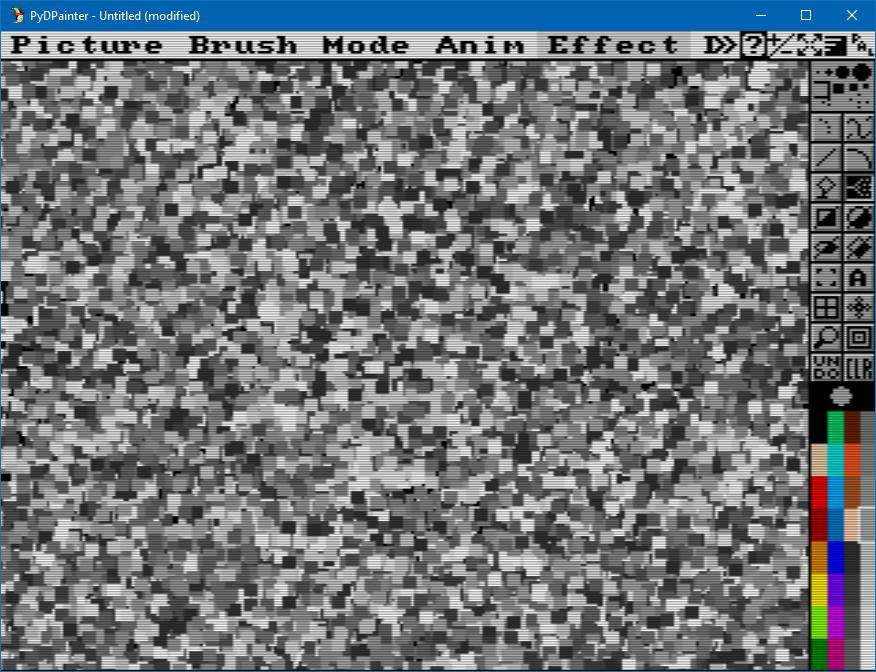

# Cloud and Noise Texture Tutorial

Need a noise or cloud texture like the old filter "Render/Clouds" in PhotoShop?

1. Pick a color that is in a color range. Let's use the grays near the end of the default palette. Click on any gray on the bottom right.

2. Select the airbrush tool (spray icon).

3. Use the menus to select Mode/Cycle (or press `F7`). If you paint with this, it will produce random gray dots around your mouse pointer.

4. Select one of the big square brushes. Hit `F7` again.

5. Click Airbrush again and then paint on the canvas to spread a lot of small squares with different shades of gray. Continue to fill the screen like this:

(Tip: You can paint under the tool bar and menus by continuing to hold the mouse button down as you move the airbrush tool into the these areas.)

6. Hit TAB key for fun.
You now have an ophthalmic headache. :laughing: Hit TAB again to switch off.

7. Now we need to blur/smooth this psychedelic pattern. Use SMOOTH MODE (hit `F8` or Mode menu, Smooth).
But you can only paint with this, not fill the whole screen.
Hit `d` for draw tool. Select the large circle brush on top right.
Use Smooth mode again (`F8`)
Try it out to see what it does. It's smoothing the pixel edges. Since we there are enough color shades in-between available in current palette we get a nice smooth look.

8. To paint efficiently, we need a LARGE brush. Enlarge your circle brush using the plus key `+=` or the `shift-H` key to double its size.

9. Paint all the screen to smooth with this large brush. You may see the ZZz pointer a bit as PyDPainter works to smooth large areas.

When you're done it should look like a screenful of clouds:

## Tips

* Pay attention that every time you select a new brush, Mode is on Color again. You have to select Cycle or Smooth mode again.
* Smooth Mode is a bit rough sometimes with a large brush. If you want quality anti-aliasing that respects details, you'll have to smooth with a smaller brush, pixel by pixel to get the right effect.
Usually I use the second smallest `+`-shaped circle brush to smooth the edges of objects. This gives a nice blurred look on the edges without blurring too much of the inside of the object.

In the [next tutorial](../plasma/Plasma.md), we'll show you how you can easily draw the Sun, planets, and plasma balls like these:

###### Tutorial written by Stephane Anquetil
